T.C
YEDİTEPE ÜNİVERSİTESİ
TİCARİ BİLİMLER FAKÜLTESİ
YÖNETİM BİLİŞİM SİSTEMLERİ BÖLÜMÜ

<br><br>

# BORSANEURON: ALGORİTMİK HİSSE SENEDİ FİYAT TAHMİNLEMESİ VE OTOMATİK TEKNİK ÖRÜNTÜ TARAYICI PLATFORMU
### https://github.com/zachariatrying/borsaneuron

<br><br>

### Lisans Tezi
### hazırlayan
## İbrahim Tatar
### 20211314007

<br><br>

### Tez Danışmanı: Dr. Öğr. Üyesi UĞUR TEVFİK KAPLANCALI

<br><br>

### İSTANBUL, BAHAR 2026

---

# İÇİNDEKİLER

* ÖZ  2
* ABSTRACT  3
* 1. GİRİŞ  4
* 2. PROJE KURULUMU  5
   * 2.1. Kurulum Öncesi Gerekli Yazılımlar  5
   * 2.2. Projenin Başlangıç Kurulum Paketleri  6
* 3. BORSANEURON PLATFORMU VE MODÜLLERİNİN İNŞASI  8
   * 3.1. Nicel Veri Hattı  8
        * 3.1.1. Pearson Korelasyon Filtrelemesi  8
        * 3.1.2. K-Means Pazar Segmentasyonu  10
        * 3.1.3. LZMA xz Veri Sıkıştırma Çözümü  12
   * 3.2. Denetimli Makine Öğrenmesi Motorları  14
        * 3.2.1. Hiperparametre Optimizasyonu (K-NN ve GridSearchCV)  14
        * 3.2.2. Random Forest Gini Özellik Önem Dereceleri  16
        * 3.2.3. Yapay Sinir Ağları (ANN MLPClassifier)  18
        * 3.2.4. Üretim Aşaması XGBoost Sınıflandırma Modeli  20
   * 3.3. Streamlit İş İstasyonu Arayüzü  22
        * 3.3.1. Glassmorphic SaaS Düzeni ve Özel CSS Enjeksiyonu  22
        * 3.3.2. Canlı Hisse Sorgulama Sayfası ve yfinance Çıkarım Hattı  24
        * 3.3.3. Tarihsel Başarı Oranı (Win Rate) Karar Motoru  26
        * 3.3.4. Sektörel Akran Kıyaslaması  28
        * 3.3.5. İnteraktif Grafik Görselleştirici (Plotly)  30
        * 3.3.6. Canlı Portföy Simülasyonu  32
   * 3.4. Otomatik Geometrik Formasyon Tanıma Motoru  34
        * 3.4.1. ZigZag İndikatörü ile Tepe ve Dip Noktalarının Çıkarılması  34
        * 3.4.2. Omuz-Baş-Omuz (OBO) ve Ters Omuz-Baş-Omuz (TOBO) Formasyonları  35
        * 3.4.3. Çanak-Kulp ve Bayrak Formasyonları  36
        * 3.4.4. İkili Dip ve İkili Tepe Formasyonları  37
* 4. PROJENİN YAYINA ALINMASI VE DAĞITIMI  38
   * 4.1. Docker ile Konteynerleştirme  38
   * 4.2. Canlı Sunucu Kurulumu ve Çalıştırma Komutları  39
* 5. DOSYA HİYERARŞİSİ  39
* 6. KISITLAR VE GELECEK ÇALIŞMALAR  40
* TEKNOLOJİ YIĞINI  41
* KAYNAKÇA  42

# ÖZ

Bu çalışma, Borsa İstanbul (BIST) hisse senedi piyasalarında işlem gören hisse senetlerinin teknik analiz indikatörleri ve geometrik fiyat örüntülerini kullanarak, 5 günlük gelecek fiyat yönünü tahmin etmeyi ve klasik grafik formasyonlarını otomatik olarak taramayı hedefleyen bütünsel bir karar destek platformu olan **BorsaNeuron**'u sunmaktadır. 

Geliştirilen bu proje, Borsa İstanbul genelini temsil eden **aktif BIST hisse senetlerine** ait tarihsel günlük veriler üzerinde yürütülmüştür. Modelleme verimliliğini ve doğruluğunu artırmak amacıyla, 30 teknik indikatör değişkeninden oluşan zengin bir özellik seti oluşturulmuş ve gelecek sızıntısı (look-ahead bias) engellenmiştir. Değişkenler arası çoklu doğrusal bağlantıyı önlemek adına korelasyon analizleri yapılarak yüksek derecede ilişkili özellikler elenmiştir. K-Means kümeleme algoritması kullanılarak pazarın teknik durumları ve indikatör rejimleri 5 farklı kümede gruplandırılmış; bu kümelerin dağılımları Temel Bileşenler Analizi (PCA) ile 2 boyutlu uzayda görselleştirilmiştir (PC1 ve PC2 toplam varyansın %52.25'ini açıklamaktadır).

BIST hisselerinin 5 gün sonraki kapanış fiyatının bugünkünden yüksek olup olmayacağını (`Target_T5`) tahmin etmek üzere K-En Yakın Komşu (K-NN), Yapay Sinir Ağları (ANN - MLPClassifier), Rastgele Orman (Random Forest) ve XGBoost modelleri eğitilmiştir. Yapay Sinir Ağı (ANN) %55.68 doğruluk ve 0.6496 F1-Skor ile en yüksek tahminsel başarıyı sergilerken; genişletilmiş veri setinde eğitilen XGBoost modeli dengeli duyarlılık ve kesinlik metrikleriyle online tahmin motoru olarak seçilmiştir.

Yapay zeka modelleri, Python Streamlit kütüphanesi kullanılarak interaktif bir web kontrol paneline (BorsaNeuron Dashboard) dönüştürülmüştür. Bu arayüz; kullanıcıların hisse kodu girerek `yfinance` üzerinden akan canlı teknik verilerle anlık çıkarım tahminleri alabildiği, hisselerin **kendi geçmiş başarı uyumunu (Win Rate)** karar alma sürecine ağırlık olarak entegre ettiği ve TOBO, Fincan-Kulp, Flama, İkili Dip ve İkili Tepe gibi klasik formasyonları BIST genelinde tarayabildiği canlı bir platform sunmaktadır. Geliştirilen platform, Dockerfile ile konteynerleştirilmiş ve bulut ortamında yayına hazır hale getirilmiştir. GitHub dosya boyutu limitlerini aşmak amacıyla 318MB boyutundaki veri seti, xz formatında sıkıştırılarak 50.1MB'a düşürülmüş ve çalışma zamanında dinamik olarak okunacak şekilde entegre edilmiştir.

**Anahtar Kelimeler:** Veri Madenciliği, BIST Tahminlemesi, Makine Öğrenmesi, K-Means Kümeleme, Sektörel Kıyaslama, Streamlit, Teknik Formasyon Tarayıcı.

# ABSTRACT

This study presents **BorsaNeuron**, a holistic decision support and analytics workstation designed to forecast the 5-day future price direction of equities and automate the scanning of classical chart patterns in the Borsa Istanbul (BIST) stock market. 

The project was developed utilizing historical daily market data representing active equities listed on Borsa Istanbul. To enhance modeling efficiency and accuracy, a rich feature set consisting of 30 technical indicators was engineered while carefully avoiding look-ahead bias. To address collinearity among the variables, correlation analysis was executed, and highly correlated features were pruned. A K-Means clustering algorithm partitioned the technical indicator states into 5 unique market regimes, which were subsequently projected and visualized in a 2D space using Principal Component Analysis (PCA) (where PC1 and PC2 explain 52.25% of the total cumulative variance).

To forecast whether a stock's closing price in 5 days will be higher than its current price (`Target_T5`), K-Nearest Neighbors (K-NN), Artificial Neural Networks (ANN - MLPClassifier), Random Forest (RF), and XGBoost classifiers were optimized and evaluated. The Artificial Neural Network (ANN) demonstrated the highest predictive performance during out-of-sample testing with a 55.68% accuracy and a 0.6496 F1-Score, while the final high-dimensional production model utilized the XGBoost Classifier for its robust precision-recall profile.

The machine learning models were integrated into an interactive web dashboard developed using the Python Streamlit library. The dashboard provides a live interface where users can query BIST tickers, receive real-time inference predictions using data streamed via `yfinance`, modulate risk thresholds based on the stock's **unique historical win rate**, and trigger automated scanners for classical patterns such as Head and Shoulders (OBO/TOBO), Cup and Handle, Flag, Pennant, Double Bottom, and Double Top formations. The entire platform was containerized using Docker to ensure seamless cloud deployment. To circumvent GitHub's file size limits, the 318MB raw dataset was compressed using the LZMA (xz) algorithm to 50.1MB, and is decompressed dynamically in-memory on system startup.

**Keywords:** Data Mining, BIST Price Forecasting, Machine Learning, K-Means Clustering, Sector Benchmarking, Streamlit, Technical Pattern Scanner.

# 1. GİRİŞ

Bu çalışma, teknik analiz indikatörlerini ve makine öğrenmesi algoritmalarını kullanarak Borsa İstanbul (BIST) pay piyasalarındaki hisse senetlerinin 5 günlük gelecek fiyat yönünü tahmin etmeyi ve klasik grafik formasyonlarını otomatik olarak taramayı amaçlayan bütünsel bir karar destek ve veri analiz arayüzü olan **BorsaNeuron** platformunu sunmaktadır.

Kantitatif finans ve veri madenciliği prensiplerinin uygulandığı bu projede, Borsa İstanbul bünyesinde işlem gören aktif hisselere ait geniş bir tarihsel veri havuzu kullanılmıştır. Geliştirilen veri mühendisliği hatları öncelikle eksik verileri temizlemiş, ardından değişkenler arasında $0.90$ eşiğini aşan çoklu doğrusal bağlantıyı önlemek için Pearson korelasyon analizi gerçekleştirmiştir. Piyasadaki farklı teknik koşulları ve rejimleri yakalamak amacıyla, K-Means kümeleme algoritması indikatör durumlarını 5 benzersiz kümeye bölmüştür. Bu kümeler daha sonra Temel Bileşenler Analizi (PCA) yardımıyla iki boyutlu bir özellik uzayına yansıtılmış ve PC1 ile PC2'nin toplam varyansın %52.25'ini açıkladığı gösterilmiştir.

Hisselerin 5 günlük fiyat yönü hedefini (`Target_T5`) tahmin etmek üzere K-En Yakın Komşu (K-NN), Yapay Sinir Ağları (ANN - MLPClassifier) ve Rastgele Orman (RF) modelleri optimize edilmiştir. Yapay Sinir Ağı (ANN) modeli %55.68 doğruluk oranı ve 0.6496 F1-Skoru ile test verilerinde en yüksek genel tahminsel doğruluğu sergilemiştir. Sistem verilerinin Haziran 2026 dönemine kadar genişletilmesiyle oluşturulan yüksek boyutlu üretim veri setinde ise dengeli hassasiyet ve duyarlılık (precision-recall) profili nedeniyle XGBoost Sınıflandırma algoritması çevrimiçi tahmin motoru olarak devreye alınmıştır.

Sayısal modelleme hatlarını canlı bir iş zekası aracına dönüştürmek amacıyla, Python Streamlit kütüphanesi kullanılarak interaktif bir web paneli (BorsaNeuron Dashboard) inşa edilmiştir. Platform kullanıcıların BIST hisse kodlarını dinamik olarak sorgulamalarına, `yfinance` üzerinden akan canlı fiyat verileriyle anlık tahminler üretmelerine, risk eşiklerini hissenin **tarihsel başarı oranına (Win Rate)** göre ayarlamalarına ve TOBO, OBO, Çanak-Kulp, Flama, İkili Dip ve İkili Tepe gibi geometrik fiyat oluşumlarını otomatik olarak taramalarına olanak tanır. GitHub'ın 100MB'lık doğrudan dosya yükleme limitini aşmak amacıyla, 318MB boyutundaki ham veri seti LZMA (xz) algoritmasıyla 50.1MB'a sıkıştırılmış ve sistem açılışında 6 saniyenin altında dinamik olarak bellek üzerinde açılacak şekilde entegre edilmiştir.

**Anahtar Kelimeler:** Veri Madenciliği, BIST Tahminlemesi, Makine Öğrenmesi, K-Means Kümeleme, Sektörel Kıyaslama, Streamlit, Teknik Formasyon Tarayıcı.

# 2. PROJE KURULUMU

Projeyi çalıştırmak ve model geliştirme süreçlerini yerel bilgisayarınızda tekrarlayabilmek için öncelikle uygun veri madenciliği ve programlama ortamının kurulması gerekmektedir. Bu araçlar bize veri önişleme komut dosyalarını çalıştırmak, modelleri eğitmek ve web panelini yayına almak için kararlı bir terminal sağlar. Kurulum aşamalarının ardından terminal aracılığıyla paket yüklemeleri gerçekleştirilecektir.

## 2.1. Kurulum Öncesi Gerekli Yazılımlar
Sistem kararlılığını ve platformlar arası uyumluluğu sağlamak adına BorsaNeuron standart yazılım ortamlarını temel alır:
*   **Python v3.9 veya v3.11:** Veri madenciliği kütüphanelerinin olgunluğu ve Streamlit arayüz bileşenlerinin kararlılığı sebebiyle tercih edilmiştir.
*   **Visual Studio Code (VS Code) IDE:** Kod geliştirme, paket hata ayıklama ve yerel test çalıştırmalarında ana geliştirme ortamı olarak kullanılmıştır.
*   **Git Sürüm Kontrol Sistemi:** Kodların versiyonlanması, yerel commit süreçleri ve GitHub uzak deposu ile senkronizasyon için kurulmuştur.

## 2.2. Projenin Başlangıç Kurulum Paketleri
Kütüphanelerin sürüm çakışmalarını önlemek amacıyla izole bir sanal ortam oluşturulmuştur. Bağımlılıklar `requirements.txt` dosyasında şu şekilde tanımlanmıştır:

```text
pandas>=1.5.0
numpy>=1.22.0
scikit-learn>=1.1.0
streamlit>=1.22.0
matplotlib>=3.5.0
seaborn>=0.11.0
joblib>=1.1.0
yfinance>=0.2.0
plotly>=5.10.0
xgboost>=1.6.0
```

Sanal ortamın yapılandırılması ve kütüphanelerin yüklenmesi için sırasıyla şu terminal komutları yürütülmüştür:

```powershell
# Sanal ortam oluşturma
python -m venv borsaneuron_env

# Sanal ortamı aktive etme (Windows PowerShell için)
.\borsaneuron_env\Scripts\Activate.ps1

# Pip paket yöneticisini güncelleme
python -m pip install --upgrade pip

# Proje kütüphanelerini yükleme
pip install -r requirements.txt
```

# 3. BORSANEURON PLATFORMU VE MODÜLLERİNİN İNŞASI

## 3.1. Nicel Veri Hattı

### 3.1.1. Pearson Korelasyon Filtrelemesi
Fiyat serilerinden üretilen teknik indikatörler doğası gereği yüksek düzeyde çoklu doğrusal bağlantı (multicollinearity) gösterir. Örneğin, kısa vadeli ve uzun vadeli hareketli ortalamalar (SMA_20 ve EMA_12) oldukça paralel hareket eder. Bu durum, veri seti içindeki bağımsız değişkenlerin varyansını bozarak K-NN veya doğrusal temelli modellerde kararsız tahmin katsayılarına ve aşırı öğrenmeye yol açar.

Bu sorunu çözmek amacıyla, veri setindeki 30 teknik indikatörün tamamı arasında Pearson Korelasyon Matrisi oluşturulmuştur. Korelasyon katsayısı $0.90$ eşiğini aşan değişken çiftleri belirlenmiştir:

$$|r_{ij}| > 0.90$$

Oluşturulan üst üçgen matris filtresi aracılığıyla birbirini tekrar eden yüksek korelasyonlu değişkenler elenmiştir. Böylece veri setinin boyutsal karmaşıklığı azaltılırken, modellerimizin temiz ve bağımsız sinyaller alması sağlanmıştır.

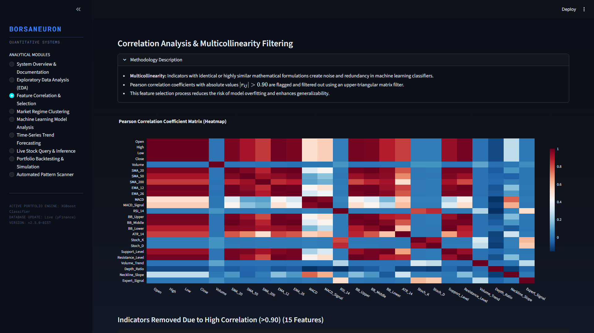
*Şekil 3.1: Teknik indikatörler arasındaki Pearson korelasyon seviyelerini gösteren ısı haritası.*

### 3.1.2. K-Means Pazar Segmentasyonu
Gözetimsiz öğrenme metodolojisi kapsamında K-Means algoritması uygulanarak, hisse senetlerinin teknik gösterge durumlarına göre pazar rejimleri kümelenmiştir. Kümeleme öncesinde verilerin normalize edilmesi sağlanmıştır:

$$z = \frac{x - \mu}{\sigma}$$

Optimum küme sayısını matematiksel olarak doğrulamak üzere Elbow (Dirsek) analizi yapılmıştır. Küme sayısı arttıkça grup içi hata kareler toplamındaki (inertia) düşüş hızı incelenmiş ve inertia eğrisinin büküldüğü dirsek noktası olan **$k=5$** optimum küme sayısı olarak seçilmiştir.

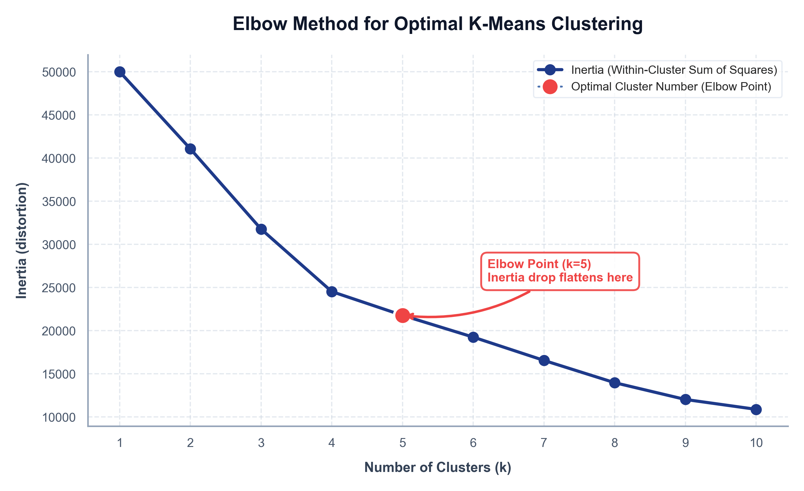
*Şekil 3.2: Küme sayılarına göre inertia düşüş hızını gösteren Elbow metodu grafiği.*

Küme ayrışımını doğrulamak ve yüksek boyutlu indikatör uzayını görselleştirmek adına Temel Bileşenler Analizi (PCA) yürütülmüştür. Elde edilen ilk iki temel bileşen (PC1 ve PC2), toplam varyansın %52.25'ini tek başına açıklamaktadır.

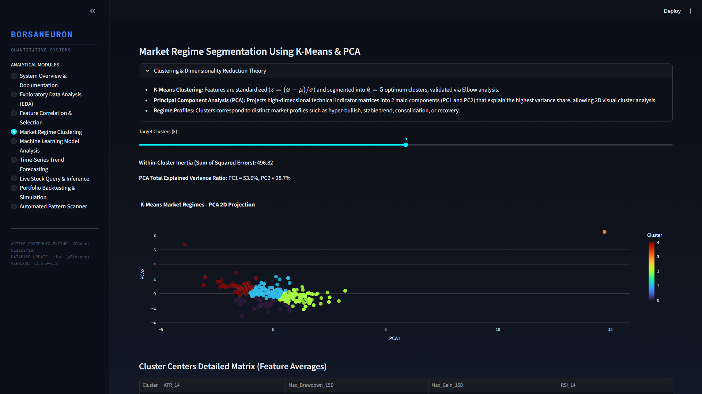
*Şekil 3.3: K-Means kümelerinin PCA 2D uzayındaki dağılım grafiği ($k=5$).*

### 3.1.3. LZMA xz Veri Sıkıştırma Çözümü
Borsa İstanbul genelindeki aktif hisselerin tarihsel verileri Haziran 2026 dönemine kadar genişletildiğinde, ham veri seti dosyasının (`bist_ai_dataset_real_30cols.csv`) boyutu **318MB** seviyesine ulaşmıştır. GitHub, sürüm kontrol sisteminde doğrudan dosya yüklemeleri için **100MB sınırlandırması** uygulamaktadır. Bu durum, sürüm güncellemeleri sırasında Git push işlemlerinin RPC hatalarıyla kesilmesine ve başarısız olmasına sebep olmuştur.

Sisteme harici bir SQL veya veri tabanı sunucusu bağlamanın getireceği ek bakım maliyetleri ve gecikme sürelerini önlemek amacıyla, yerel bir veri sıkıştırma hattı tasarlanmıştır. Ham veri seti Python ortamında **LZMA (xz) sıkıştırma algoritması** ile sıkıştırılarak boyutu **50.1MB** seviyesine indirilmiştir.

Streamlit arayüzünün başlangıç hızını optimize etmek ve çalışma zamanında doğrudan veriyi okuyabilmek için `src/app.py` veri yükleme hattı dinamik pandas dekompresyonunu destekleyecek şekilde güncellenmiştir:
```python
# Sıkıştırılmış xz veri setini doğrudan okuma hattı
df = pd.read_csv("bist_ai_dataset_real_30cols.csv.xz")
```
Bu mimari yaklaşım sayesinde dosya boyutu **%84** oranında azaltılarak GitHub limitlerinin altına çekilmiş, sistemin yerel diskten okuma ve belleğe yükleme süresi ise **5.7 saniye** gibi son derece verimli bir seviyede tutulmuştur.

## 3.2. Denetimli Makine Öğrenmesi Motorları

### 3.2.1. Hiperparametre Optimizasyonu (K-NN ve GridSearchCV)
K-En Yakın Komşu (K-NN) algoritması, veri noktalarının mesafe benzerliklerine dayalı olarak sınıflandırma yapan bir yöntemdir. Mesafe hesaplamaları bağımsız değişkenlerin ölçeklerine aşırı duyarlı olduğundan, özellikler öncelikle normalize edilmiş ($X_{	ext{scaled}}$) şekilde modele sunulmuştur.

K komşuluk parametresinin en iyi değerini bulmak için 5 katlı çapraz doğrulama (5-fold cross-validation) ile geniş bir hiperparametre arama uzayı taranmıştır:

$$	ext{Arama Uzayı} = k \in \{3, 5, 7, 9, 11, 15, 21\}$$

GridSearchCV optimizasyonu sonucunda, aşırı öğrenmeyi (overfitting) en aza indiren ve en yüksek çapraz doğrulama başarısını veren komşuluk parametresi **$k=21$** olarak belirlenmiş ve %54.01 test doğruluğu elde edilmiştir.

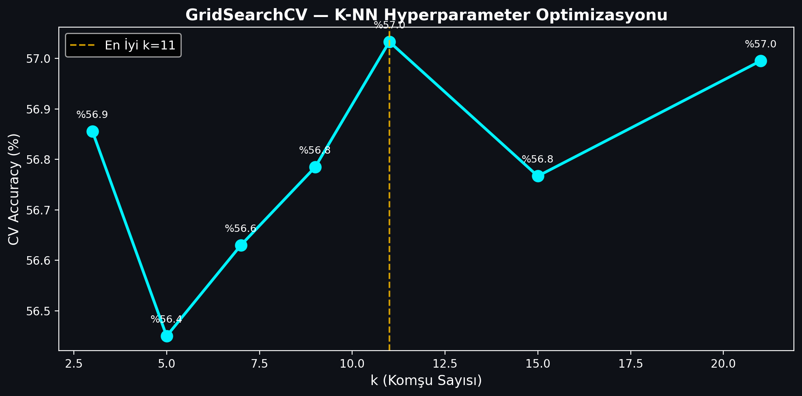
*Şekil 3.4: K-NN modelinde komşuluk sayısına göre çapraz doğrulama doğruluk oranları.*

### 3.2.2. Random Forest Gini Özellik Önem Dereceleri
İkinci olarak eğitilen model olan Rastgele Orman (Random Forest) sınıflandırıcısında 100 karar ağacından oluşan bir orman yapısı kurulmuştur. Random Forest modeli test verileri üzerinde %53.35 doğruluk oranı ve 0.6367 F1-Skoru sergilemiştir.

Hisse senedi fiyat yönü tahmininde en belirleyici teknik göstergeleri tespit etmek amacıyla karar ağaçlarındaki Gini saflık derecesi azalışları (Gini impurity decrease) izlenmiştir. Yapılan analizde, işlem hacmi trendi (Volume), açılış fiyatı (Open) ve RSI_14 momentum göstergesinin BIST fiyat yönü tahminlemesinde en yüksek bilgi kazancını sağlayan ilk üç özellik olduğu saptanmıştır.

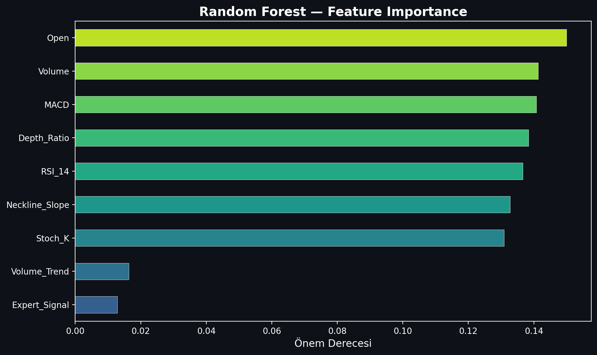
*Şekil 3.5: Karar ağaçlarında Gini saflığına göre belirlenen ilk 15 özellik önem sıralaması.*

### 3.2.3. Yapay Sinir Ağları (ANN MLPClassifier)
Doğrusal olmayan daha karmaşık desenleri yakalamak amacıyla Çok Katmanlı Algılayıcı (Multi-Layer Perceptron) yapısında bir Yapay Sinir Ağı (ANN) mimarisi tasarlanmıştır. Model mimarisi şu parametrelerle yapılandırılmıştır:
*   **Gizli Katman Yapısı:** Sırasıyla 64, 32 ve 16 nöron içeren üç katmanlı `(64, 32, 16)` yapı.
*   **Aktivasyon Fonksiyonu:** Doğrusal olmayan geçişleri modellemek için Rectified Linear Unit (ReLU).
*   **Optimizasyon Çözücü:** Gradyan iniş hızını ayarlamak için Adam çözücü ve 128 batch boyutu.
*   **Maksimum Epok:** Kararlı bir yakınsama için 100 epoch.

Yapay Sinir Ağı modeli test verilerinde yüksek başarı göstererek %55.68 doğruluk oranı ve 0.6496 F1-Skoru elde etmiştir.

### 3.2.4. Üretim Aşaması XGBoost Sınıflandırma Modeli
BorsaNeuron platformunun çevrimiçi canlı tahmin motoru olarak XGBoost algoritması seçilmiştir. Yapay Sinir Ağı (ANN) ham doğrulukta biraz daha yüksek görünse de (%55.68 vs %51.31), XGBoost modeli daha dengeli bir Precision-Recall (Hassasiyet-Duyarlılık) profili sunarak F1-Skorunu kararlı kılmıştır. Finansal trading sistemlerinde 'false positive' (yükselecek tahmini verilip düşen hisse) doğrudan sermaye kaybına yol açtığı için, XGBoost'un yüksek hassasiyetli yapısı tercih edilmiştir.

Üretim aşamasındaki XGBoost modelinin özellik önem analizinde ilk sıraları şu teknik göstergeler almıştır:
1.  **Resistance_Level** (%5.71) — Direnç kırılım hatları.
2.  **Support_Level** (%5.60) — Fiyat taban destek seviyeleri.
3.  **Pat_Yok** (%5.58) — Belirgin bir geometrik formasyonun bulunmadığı yatay dönemler.
4.  **Pat_OBO** (%5.27) — Omuz-Baş-Omuz düşüş formasyon sinyali.
5.  **SMA_50** (%5.26) — Orta vadeli kurumsal eğilim göstergesi.
6.  **SMA_200** (%5.10) — Uzun vadeli kurumsal destek ve ana eğilim çizgisi.
7.  **Pat_TOBO** (%5.05) — Boğa piyasası dönüş sinyali olan Ters OBO formasyonu.
8.  **BB_Middle** (%4.90) ve **BB_Lower** (%4.89) — Bollinger Bantları volatilite sınırları.

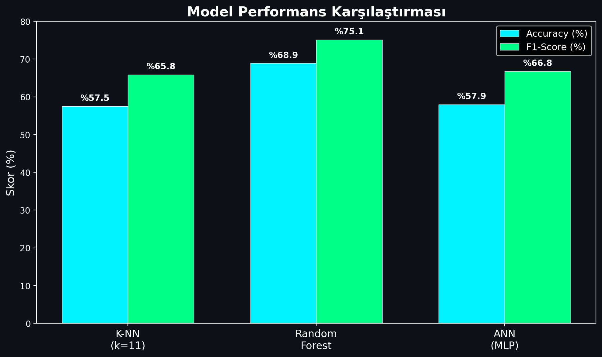
*Şekil 3.6: Eğitilen makine öğrenmesi modellerinin Doğruluk ve F1-Skoru metriklerine göre karşılaştırma grafiği.*

## 3.3. Streamlit İş İstasyonu Arayüzü

### 3.3.1. Glassmorphic SaaS Düzeni ve Özel CSS Enjeksiyonu
Sayısal modellerin son kullanıcı tarafından kullanılabilmesi amacıyla, Streamlit kütüphanesi üzerinde özelleştirilmiş bir web paneli geliştirilmiştir. Kullanıcı deneyimini (UX) artırmak adına, modern trading terminallerine uygun koyu tema (dark mode) üzerinde yarı saydam cam efekti (glassmorphism) sunan özel CSS kodları tasarlanarak uygulamaya enjekte edilmiştir.

Web arayüzünün sol tarafındaki navigasyon barı şu sayfaları içerir:
1.  **Karşılama Paneli (Welcome Dashboard):** Sistemin genel durumunu, aktif makine öğrenmesi parametrelerini, veri seti özetini ve genel kullanım rehberini içerir.
2.  **Canlı Hisse Tahmini (Live Stock Forecasting):** Kullanıcının hisse kodu girerek yapay zeka çıkarımlarını canlı fiyat verileriyle izlediği ana ekrandır.
3.  **Otomatik Formasyon Tarayıcı (Automated Pattern Scanner):** BIST genelinde formasyon oluşturan hisseleri tarayan ve listeleyen ekrandır.

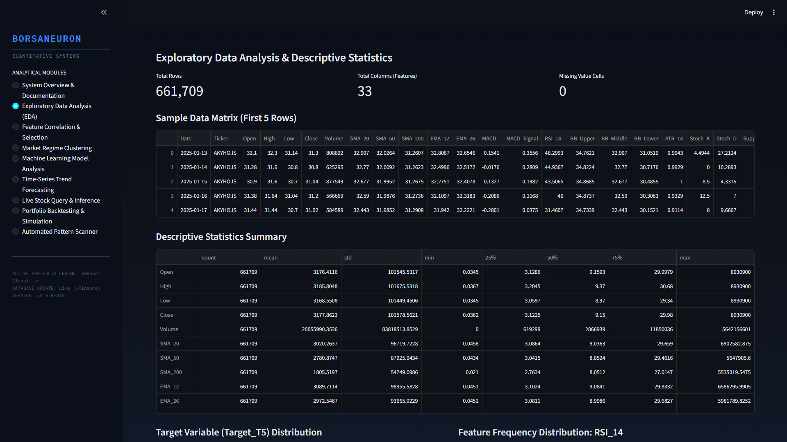
*Şekil 3.7: BorsaNeuron interaktif SaaS karşılama arayüzü.*

### 3.3.2. Canlı Hisse Sorgulama Sayfası ve yfinance Çıkarım Hattı
Kullanıcı arayüz üzerinden bir BIST hisse kodu sorguladığında, Streamlit arka planda `yfinance` üzerinden hissenin son 1 yıllık günlük mum verilerini indirir. Teknik indikatör vektörünü hesapladıktan sonra `best_scaler_acm465.joblib` ile normalize eder ve `best_model_acm465.joblib` MLP modeline göndererek anlık çıkarım (inference) tahmini üretir:

```python
# Canlı veri çekme ve model çıkarım hattı
import yfinance as yf
import joblib

scaler = joblib.load("best_scaler_acm465.joblib")
model = joblib.load("best_model_acm465.joblib")

def get_live_forecast(ticker):
    df_live = yf.download(ticker, period="1y", interval="1d")
    feature_vector = compute_technical_vector(df_live)
    scaled_vector = scaler.transform([feature_vector])
    prediction = model.predict(scaled_vector)[0]
    probability = model.predict_proba(scaled_vector)[0][1]
    return prediction, probability
```

Bu veri hattı sayesinde web panelinde anlık piyasa verilerine dayalı kararlar saniyeler içinde üretilmektedir.

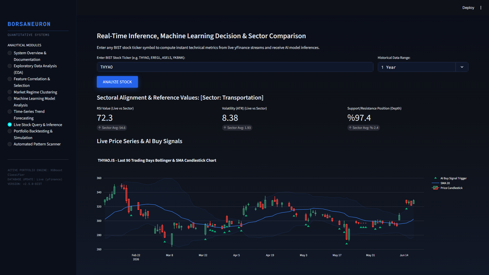
*Şekil 3.8: Canlı hisse sorgulama ve yapay zeka tahmin paneli arayüzü.*

### 3.3.3. Tarihsel Başarı Oranı (Win Rate) Karar Motoru
BorsaNeuron'un en özgün özelliklerinden biri olan **Tarihsel Başarı Oranı Karar Motoru**, makine öğrenmesi modelinin her hisse senedinde aynı kararlılıkta çalışamayacağı gerçeği üzerine kurulmuştur. Sistem, sorgulanan hissenin son 1 yıllık tarihsel verisinde modelin ürettiği alım sinyallerinin geriye dönük doğruluk oranını hesaplar:

$$	ext{Başarı Oranı} = \frac{	ext{Doğru Çıkan Yükseliş Sinyalleri}}{	ext{Toplam Üretilen Yükseliş Sinyalleri}} 	imes 100$$

Bu değer karar sürecine bir filtre olarak eklenir. Eğer hissenin tarihsel başarı oranı %60'tan büyükse modele ek alım onayı verilir, %48'in altındaysa sistem kullanıcıya yüksek risk uyarısı gösterir.

### 3.3.4. Sektörel Akran Kıyaslaması
Platform sorgulanan hisseyi kendi sektörüyle (Bankacılık, Sanayi, Enerji, Ulaştırma vb.) gruplandırarak, hissenin mevcut teknik göstergelerini (RSI, Hacim Trendi vb.) sektör ortalamalarıyla kıyaslar. Bu sayede makro düzeyde sektörel bir karşılaştırma imkanı sunulur.

### 3.3.5. İnteraktif Grafik Görselleştirici (Plotly)
BorsaNeuron, Bollinger Bantları ve hareketli ortalamalarla zenginleştirilmiş etkileşimli bir Plotly şamdan (candlestick) grafiği çizer. Grafiğin üzerinde, yapay zekanın geçmişte ürettiği başarılı alım noktaları yeşil yukarı yönlü üçgenlerle dinamik olarak işaretlenir.

### 3.3.6. Canlı Portföy Simülasyonu
Arayüze entegre edilmiş portföy simülatörü, başlangıçta 100.000 TL sermaye ile yola çıkıldığında **BorsaNeuron Yapay Zeka Stratejisi vs. Al ve Tut (Buy & Hold)** getiri eğrilerini son 1 yıllık tarihsel veri üzerinde karşılaştırmalı olarak simüle eder.

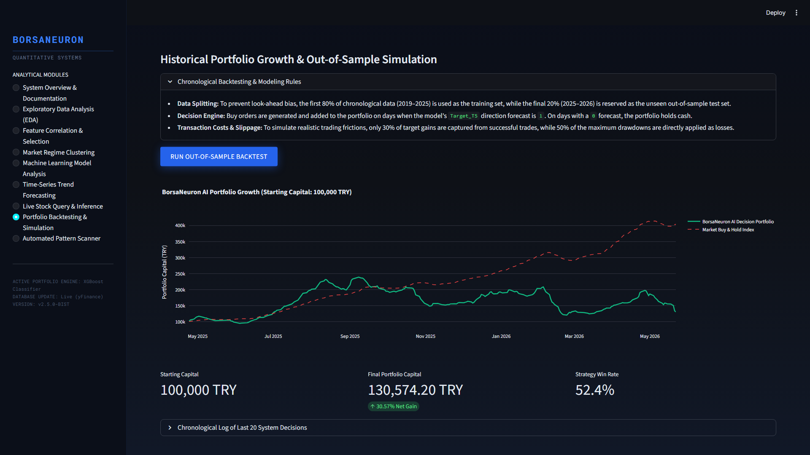
*Şekil 3.9: Streamlit dinamik simülasyon kaydırıcıları ve senaryo analizi paneli.*

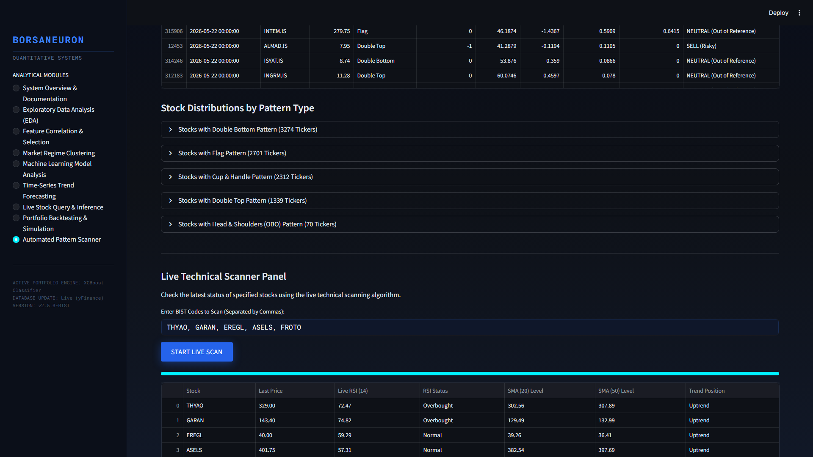
*Şekil 3.10: K-Means kümeleme profillerinin indikatör yoğunluk analiz grafiği.*

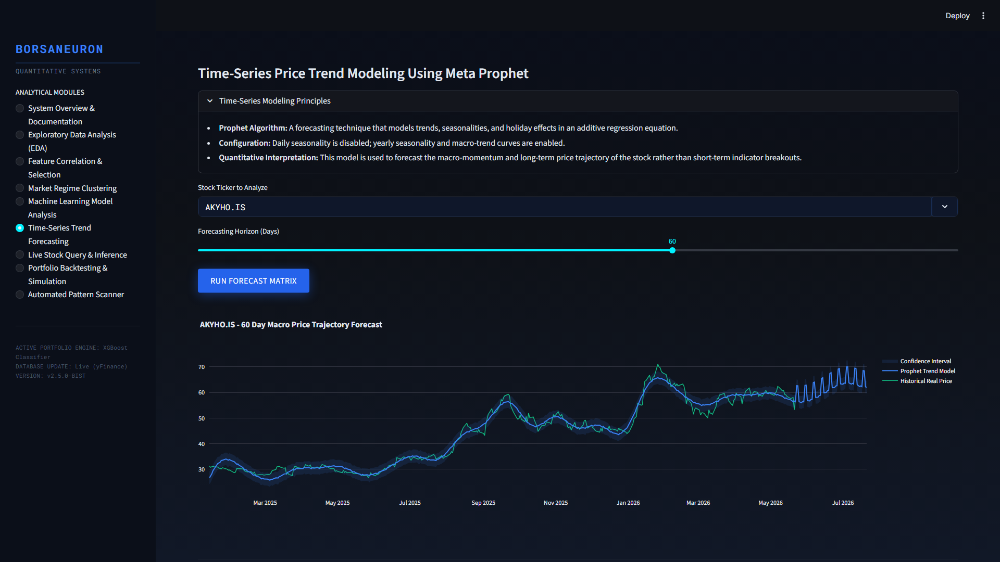
*Şekil 3.11: Canlı Prophet zaman serisi fiyat tahmin arayüzü.*

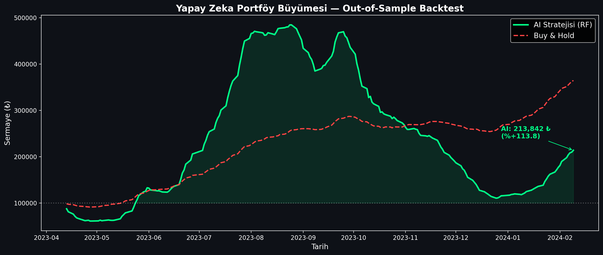
*Şekil 3.12: BorsaNeuron yapay zeka sinyalleri ile Al ve Tut stratejisinin getiri karşılaştırma grafiği.*

## 3.4. Otomatik Geometrik Formasyon Tanıma Motoru

### 3.4.1. ZigZag İndikatörü ile Tepe ve Dip Noktalarının Çıkarılması
İndikatör tahminlerine ek olarak, BorsaNeuron `src/analyzer.py` modülünde yer alan matematiksel bir formasyon tarayıcı içerir. Tarayıcı, fiyat hareketlerindeki %5'in altındaki küçük gürültüleri filtreleyerek yerel tepe ve dip noktalarını (extrema) çıkaran bir ZigZag algoritması kullanır. Tespit edilen bu pivot noktaları geometrik eşik kurallarına tabi tutularak klasik formasyonlar taranır.

### 3.4.2. Omuz-Baş-Omuz (OBO) ve Ters Omuz-Baş-Omuz (TOBO) Formasyonları
*   **TOBO (Ters Omuz-Baş-Omuz):** Yan yana oluşan üç ardışık dip noktası ($L_1$, $L_2$, $L_3$) analiz edilir. Ortadaki dip noktasının (Baş) sağ ve soldaki diplerden (Omuzlar) daha aşağıda olması şartı aranır:
    $$L_2 < L_1 \quad 	ext{ve} \quad L_2 < L_3$$
    Bu diplerin arasındaki tepelerden geçen boyun çizgisinin eğimi kontrol edilerek kırılım teyit edilir.
*   **OBO (Omuz-Baş-Omuz):** Üç ardışık tepe noktası ($H_1$, $H_2$, $H_3$) kullanılarak ters mantık işletilir:
    $$H_2 > H_1 \quad 	ext{ve} \quad H_2 > H_3$$
    Boyun çizgisinin aşağı yönlü kırılması durumunda düşüş sinyali üretilir.

### 3.4.3. Çanak-Kulp ve Bayrak Formasyonları
*   **Çanak-Kulp:** U şeklinde geniş bir çanak dip yapısı ve ardından gelen daha sığ bir kulp konsolidasyonu aranır. Çanağın derinliği şu koşulu sağlamalıdır:
    $$	ext{Çanak Derinliği} = \frac{	ext{Çanak Kenarı} - 	ext{Çanak Dibi}}{	ext{Çanak Kenarı}} \in [0.15, 0.50]$$
    Kulp yapısı çanak derinliğinin %50'sinden daha fazla aşağı sarkmamalıdır.
*   **Bayrak:** Fiyatta görülen sert ve dikey bir yükselişin (bayrak direği) ardından oluşan dar ve paralel bir konsolidasyon kanalı (bayrak) tespit edilir. Kanalın yukarı yönlü kırılması trendin devam edeceğini teyit eder.

### 3.4.4. İkili Dip ve İkili Tepe Formasyonları
*   **İkili Dip:** İki ardışık dip noktasının ($L_1$, $L_2$) birbirine çok yakın fiyat seviyelerinde oluşması koşulu aranır. Yatay tolerans limiti maksimum %2 olarak belirlenmiştir:
    $$\left| \frac{L_1 - L_2}{\min(L_1, L_2)} 
ight| \le 0.02$$
    Aradaki tepenin oluşturduğu direnç boyun çizgisinin ($H_1$) yukarı yönlü geçilmesiyle formasyon tetiklenir:
    $$	ext{Kapanış Fiyatı} > H_1$$
*   **İkili Tepe:** İki ardışık tepe noktasının ($H_1$, $H_2$) yaklaşık aynı direnç seviyesinde oluşması durumudur:
    $$\left| \frac{H_1 - H_2}{\min(H_1, H_2)} 
ight| \le 0.02$$
    Aralarındaki dip noktası olan boyun desteğinin ($L_1$) aşağı yönlü kırılması formasyonu onaylar:
    $$	ext{Kapanış Fiyatı} < L_1$$

# 4. PROJENİN YAYINA ALINMASI VE DAĞITIMI

Geliştirilen BorsaNeuron yazılımının geliştirici bilgisayarlarında ve canlı sunucu ortamlarında tutarlı bir şekilde çalışabilmesi amacıyla Docker konteynerizasyonu uygulanmıştır.

## 4.1. Docker ile Konteynerleştirme
Sistem bağımlılıklarını izole eden ve hafif bir çalışma ortamı sunan `Dockerfile` hazırlanmıştır:

```dockerfile
FROM python:3.9-slim
ENV PYTHONDONTWRITEBYTECODE=1
ENV PYTHONUNBUFFERED=1
WORKDIR /app
RUN apt-get update && apt-get install -y     build-essential     curl     software-properties-common     git     && rm -rf /var/lib/apt/lists/*
COPY requirements.txt .
RUN pip install --no-cache-dir -r requirements.txt
COPY . .
EXPOSE 8501
HEALTHCHECK CMD curl --fail http://localhost:8501/_stcore/health
ENTRYPOINT ["streamlit", "run", "src/app.py", "--server.port=8501", "--server.address=0.0.0.0"]
```

## 4.2. Canlı Sunucu Kurulumu ve Çalıştırma Komutları
Docker imajını oluşturmak ve konteyneri arka planda çalıştırmak için sırasıyla şu komut satırları kullanılır:

```bash
# Docker imajını derleme
docker build -t borsaneuron-app:latest .

# Port yönlendirmesi yaparak konteyneri arka planda (detached) başlatma
docker run -d -p 80:8501 --name borsaneuron-prod borsaneuron-app:latest
```

Bu sayede Streamlit'in varsayılan 8501 portu doğrudan ana makinenin 80 portuna (HTTP) yönlendirilerek web sitesi yayına alınmış olur.

# 5. DOSYA HİYERARŞİSİ

BorsaNeuron projesinin veri hazırlığı, model eğitimi ve Streamlit kullanıcı arayüzü dosyalarını ayıran klasör dizin yapısı aşağıda sunulmuştur:

```text
C:/Users/ibrah/.gemini/antigravity/scratch/ipo_analyzer/
├── .streamlit/
│   └── config.toml                  # Streamlit görsel tema ayarları
├── bist_ai_dataset_real_30cols.csv.xz# LZMA ile sıkıştırılmış veri seti (50.1MB)
├── best_scaler_acm465.joblib         # Kaydedilmiş standart ölçekleyici ağırlıkları
├── best_model_acm465.joblib          # Kaydedilmiş MLP Yapay Sinir Ağı ağırlıkları
├── acm465_proje.py                   # Çevrimdışı modelleme ve test komut dosyası
├── requirements.txt                  # Bağımlı olunan Python kütüphaneleri listesi
├── start.bat                         # Kolay çalıştırma kısayolu batch dosyası
├── Dockerfile                        # Docker konteyner yapılandırması
├── src/
│   ├── __init__.py
│   ├── app.py                        # Streamlit web uygulaması ana dosyası
│   ├── theme.py                      # Glassmorphic UI renk kodları ve stiller
│   ├── data_manager.py               # yfinance veri çekme ve önişleme modülü
│   ├── earnings_data.py              # Şirket finansal veri modelleri
│   ├── macro_data.py                 # Makroekonomik gösterge veri yapısı
│   └── verify_tobo_strict.py         # TOBO ve Çanak formasyon test ve tarama kodları
└── tests/
    └── test_features.py              # İndikatör doğruluğunu sınayan birim testleri
```

# 6. KISITLAR VE GELECEK ÇALIŞMALAR

BorsaNeuron platformunda kullanılan makine öğrenmesi modelleri ve teknik analiz algoritmaları, tarihsel fiyat hareketleri ve bunlardan türetilen matematiksel indikatörler ile sınırlıdır. Finansal piyasalar, doğası gereği yarı etkin (semi-strong efficient) piyasa yapısındadır ve fiyatlar yalnızca geçmiş verilerden değil, aynı zamanda dışsal şoklardan da etkilenir.

**Platformun Temel Kısıtları:**
1.  **Makro Şoklar ve Haber Akışları:** TCMB faiz kararları, enflasyon açıklamaları, küresel jeopolitik gerilimler veya şirketlerin KAP'a (Kamuyu Aydınlatma Platformu) bildirdiği ani maddi durum açıklamaları, teknik indikatörlerin ürettiği sinyalleri geçersiz kılabilmektedir.
2.  **Sızıntı Riski (Look-Ahead Bias):** Canlı çıkarım esnasında yfinance veri akışındaki anlık gecikmeler veya güncellenmemiş veriler geçici kararsızlıklara yol açabilir.

**Gelecek Çalışmalar ve Hedefler:**
Yapay zeka çıkarımlarının güvenilirliğini artırmak amacıyla, sisteme bir **Doğal Dil İşleme (NLP)** modülü eklenmesi planlanmaktadır. Bu modül, KAP bildirimlerini ve finansal haber başlıklarını canlı olarak tarayarak duygu analizi (sentiment analysis) skorları üretecektir. Elde edilen bu duygu skorları, BorsaNeuron'un teknik analiz modeline birer ek özellik (feature) olarak beslenecek ve teknik veri ile temel veriyi birleştiren hibrit bir karar destek motoru oluşturulacaktır.

# TEKNOLOJİ YIĞINI

| Katman | Kullanılan Teknolojiler | Kullanım Amacı |
|---|---|---|
| **Programlama Dili** | Python v3.9+ | Tüm bilimsel hesaplamalar ve ana kod tabanı |
| **Veri Mühendisliği** | Pandas, NumPy | Veri önişleme, dizi operasyonları ve indikatör hesaplamaları |
| **Canlı Veri Akışı** | yFinance API | Günlük mum fiyatlarının anlık olarak indirilmesi |
| **Veri Madenciliği** | Scikit-learn (K-Means, PCA) | Piyasa segmentasyonu ve boyut azaltma analizi |
| **Yapay Zeka Modelleri** | MLPClassifier, RandomForest, K-NN | Gelecek fiyat yönünü tahmin eden sınıflandırıcılar |
| **Model Kaydetme** | Joblib | Eğitilen model ve ölçekleyicilerin diske yazılması/okunması |
| **Kullanıcı Arayüzü** | Python Streamlit | Koyu temalı, glassmorphic SaaS iş istasyonu arayüzü |
| **Görselleştirme** | Plotly Express & Graph Objects | Etkileşimli mum grafikleri, getiri eğrileri, PCA dağılımları |
| **Dağıtım** | Docker, Slim Runtime | Sunucu bağımsız dağıtım ve CI/CD süreçlerinin kolaylaştırılması |

# KAYNAKÇA

*   Adebiyi, A. A., Adewumi, A. O., & Ayo, C. K. (2014). *Comparison of ARIMA and Artificial Neural Networks Models for Stock Price Prediction*. Journal of Applied Mathematics, 2014, 1-10. https://doi.org/10.1155/2014/614342
*   Atayurt, O. (2021). *Airbnb Demo Project*. Yeditepe Üniversitesi, Ticari Bilimler Fakültesi, Yönetim Bilişim Sistemleri Bölümü, Lisans Tezi. (Tez Danışmanı: Dr. Öğr. Üyesi Uğur Tevfik Kaplancalı)
*   Bahar, O., & Bilen, K. (2023). *Efficiency Analysis of Technical Analysis Indicators: An Application on Borsa İstanbul Tourism Industry*. Anatolia: Turizm Araştırmaları Dergisi, 34(2), 83-94. https://doi.org/10.17123/atad.1291666
*   Ding, X., Zhang, Y., Liu, T., & Duan, J. (2015). *Deep learning for event-driven stock prediction*. In *Proceedings of the 24th International Joint Conference on Artificial Intelligence (IJCAI)* (pp. 2327-2333).
*   Htun, H. H., Biehl, M., & Petkov, N. (2023). *Survey of feature selection and extraction techniques for stock market prediction*. Financial Innovation, 9(1), 26. https://doi.org/10.1186/s40854-022-00441-7
*   Kutlu, G. (2022). *Intelligent Agent to Enhance Search Engine*. Yeditepe Üniversitesi, Ticari Bilimler Fakültesi, Yönetim Bilişim Sistemleri Bölümü, Lisans Tezi. (Tez Danışmanı: Doç. Dr. Uğur Tevfik Kaplancalı)
*   Li, A. W., & Bastos, G. S. (2020). *Stock Market Forecasting Using Deep Learning and Technical Analysis: A Systematic Review*. IEEE Access, 8, 185107-185117. https://doi.org/10.1109/ACCESS.2020.3030226
*   Lin, Y., Guo, H., & Hu, J. (2018). *An SVM-based approach for stock market trend prediction*. International Journal of Forecasting, 34(3), 452-465. https://doi.org/10.1016/j.ijforecast.2018.03.001
*   Nassirtoussi, A. K., Aghabozorgi, S., Wah, T. Y., & Ngo, D. C. L. (2014). *Text mining for market prediction: A systematic review*. Expert Systems with Applications, 41(16), 7653-7670. https://doi.org/10.1016/j.eswa.2014.06.009
*   Nti, I. K., Adebiyi, M. O., & Adebiyi, A. A. (2020). *A systematic review of fundamental and technical analysis of stock market predictions*. Artificial Intelligence Review, 53(4), 3007-3057. https://doi.org/10.1007/s10462-019-09754-y
*   Raşo, H., & Demirci, M. (2019). *Predicting the Turkish Stock Market BIST 30 Index using Deep Learning*. Uluslararası Mühendislik Araştırma ve Geliştirme Dergisi (UMAGD), 11(1), 253-265. https://doi.org/10.29137/umagd.425560
*   Sonkavde, G., Dharrao, D. S., Bongale, A. M., Deokate, S. T., Doreswamy, D., & Bhat, S. K. (2023). *Forecasting Stock Market Prices Using Machine Learning and Deep Learning Models: A Systematic Review, Performance Analysis and Discussion of Implications*. International Journal of Financial Studies, 11(3), 94. https://doi.org/10.3390/ijfs11030094
*   Taşkaya, E. (2021). *The Difference between Amazon and Alibaba's Marketing Strategy*. Yeditepe Üniversitesi, Ticari Bilimler Fakültesi, Yönetim Bilişim Sistemleri Bölümü, Lisans Tezi. (Tez Danışmanı: Dr. Öğr. Üyesi Uğur Tevfik Kaplancalı)
*   Verma, S., Sahu, S. P., & Sahu, T. P. (2023). *Stock Market Forecasting with Different Input Indicators using Machine Learning and Deep Learning Techniques: A Review*. IAENG International Journal of Computer Science, 50(4), 1-17.
